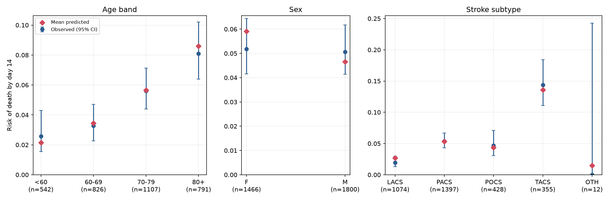

# Stroke Mortality Prediction Service

> **Research demonstration only. Not for clinical use or medical decision-making.**

This project trains, packages, and serves a machine learning model predicting 14-day mortality following acute stroke. The model is trained on a subset of the International Stroke Trial database, described under Data below. The Python implementation covers the complete lifecycle, with an emphasis on validation, model calibration, automated testing, containerised deployment, and drift monitoring. An earlier exploratory analysis of a related file in R is available at [Evaluating-survival-probability-after-a-stroke](https://github.com/dooparak-droid/Evaluating-survival-probability-after-a-stroke). It used a narrower outcome definition, and its relation to this project is described under Results.

---

## Live Demo

The service is deployed on Render's free tier at [stroke-mortality-model.onrender.com](https://stroke-mortality-model.onrender.com). Opening the link redirects to the interactive API documentation at `/docs`, where the `POST /predict` endpoint can be tried directly in the browser.

Two limitations of the free tier apply. The service sleeps after 15 minutes without traffic, so the first request after a quiet period can take about a minute. The service does not log requests. The drift check is run separately on a CSV of input records (see Drift Monitoring below).

---

## Clinical and Methodological Context

In acute stroke care, early mortality risk assessment can assist in triage, resource planning, and identifying patients at elevated risk of deterioration. 

A primary methodological challenge in this cohort is the severe **class imbalance**, with an observed event rate of **5.1%**. Standard evaluation approaches that focus purely on accuracy or discrimination (such as the Area Under the ROC Curve) can be misleading:
* A model can achieve a respectable AUC while still predicting risks that are systematically too high or too low.
* For rare adverse events, **calibration** (assessed via calibration curves and Brier score) is vital to ensure that a predicted probability of 10% genuinely corresponds to roughly 10 observed deaths per 100 similar patients.
* The classification threshold must be chosen deliberately. Here, **Youden's J statistic** is optimised strictly on cross-validation folds to balance sensitivity and specificity without data leakage into the test set. Because the event rate is low, the resulting threshold on predicted risk is also low (about 0.054), and the high-risk flag is a screening flag and not a confident prediction of death.

---

## Data

The training data are a subset of the **International Stroke Trial (IST)** database. The IST was a randomised trial of aspirin and heparin started within 48 hours of acute ischaemic stroke, run between 1991 and 1996. It randomised 19,435 patients from 467 hospitals in 36 countries, and its anonymised patient-level data were released for public reuse by the University of Edinburgh.

* **Source:** Sandercock P, Niewada M, Czlonkowska A. (2011). International Stroke Trial database (version 2), [dataset]. University of Edinburgh, Department of Clinical Neurosciences. [https://doi.org/10.7488/ds/104](https://doi.org/10.7488/ds/104)
* **Paper:** Sandercock PAG, Niewada M, Czlonkowska A. The International Stroke Trial database. *Trials* 2011, 12:101. [doi:10.1186/1745-6215-12-101](https://doi.org/10.1186/1745-6215-12-101)
* **Licence:** Open Data Commons Attribution License (ODC-By) v1.0, as shown on the DataShare record.
* **Not committed:** the data file is not stored in this repository, and the container does not include it. It must be obtained from the source above.

**Selection of patients.** The 13,063 patients used here are those from the IST database who:
1. were alert or drowsy at randomisation (patients recorded as unconscious are excluded);
2. had a recorded value for each of the 22 predictors (including each of the eight neurological deficit variables, so patients with a deficit marked "cannot assess" are excluded); and
3. had a known death status on the discharge form (IST variable `DDEAD` recorded as Y or N).

The third rule is not needed to define the outcome below. It is kept so that the patient set is identical to the one used in the earlier R analysis. All 13,063 selected patients have a known 14-day status.

**Outcome.** The outcome `death` is 1 when the IST 14-day death indicator `ID14` is 1, and 0 otherwise. `ID14` marks death within 14 days of randomisation as determined by the trial, including deaths that the discharge form does not record. There are 667 such deaths among the 13,063 patients (5.1%). The derivation matters because IST records death in two places that do not always agree:
* 612 patients died within 14 days and the death is also recorded on the discharge form (`DDEAD` = Y).
* 55 patients died within 14 days but the discharge form does not record a death (`DDEAD` = N). For 41 of the 55 the form says the patient was alive when they left hospital. They are counted as deaths here. An outcome restricted to deaths recorded on the discharge form would have 612 deaths (4.7%).
* A further 153 patients have a death recorded on the discharge form, but the time to death in IST is 15 days or longer. They are counted as survivors, because they were alive at day 14.

**Reproducing the training file.** `scripts/build_dataset.py` applies these rules to `IST_corrected.csv` from the DataShare record and writes the training file locally. The file is not committed. The IST variables map to the columns of the file as follows: `RDELAY` to `delay`, `RCONSC` to `consc`, `SEX` to `gender`, `AGE` to `age`, `RSLEEP` to `wakesym`, `RATRIAL` to `atrial`, `RCT` to `CT`, `RVISINF` to `Infarc`, `RHEP24` to `hep24`, `RASP3` to `asp3`, `RSBP` to `sbp`, `RDEF1` to `RDEF8` to `symptom1` to `symptom8`, `STYPE` to `subtype`, `RXHEP` to `treat1`, `RXASP` to `treat2`, and `ID14` to `death`.

```bash
python scripts/build_dataset.py --ist-csv path/to/IST_corrected.csv --out ../ist_stroke_14day.csv
```

The predictors include the treatment allocated in the trial (heparin dose and aspirin), as well as age, systolic blood pressure, delay from stroke onset to randomisation, stroke subtype and the neurological deficits recorded at randomisation.

---

## Project Structure

```
stroke-mortality-model/
├── .github/workflows/ci.yml    # Continuous integration with automated testing
├── Dockerfile                  # Container definition for reproducible deployment
├── app/streamlit_app.py        # Browser front end that calls the API
├── monitoring/                 # Reference distributions and drift detection
├── models/                     # Serialised model pipelines and metadata
├── reports/                    # Calibration curve, calibration by subgroup, and evaluation tables
├── scripts/build_dataset.py    # Builds the training file from the IST database
├── src/stroke_model/
│   ├── __init__.py
│   ├── api.py                  # FastAPI service with validated schemas
│   ├── data.py                 # Data loading and stratified splitting
│   ├── features.py             # Feature definitions and preprocessing pipeline
│   ├── train.py                # Hyperparameter tuning and model training
│   ├── evaluate.py             # Calibration, Brier score, and discrimination metrics
│   ├── predict.py              # Inference interface
│   └── reference.py            # Training reference bins and Population Stability Index
├── tests/                      # Unit, schema validation, regression, and drift tests
├── pyproject.toml              # Build system and package configuration
├── requirements.txt            # Pinned dependencies
└── README.md
```

---

## Local Setup

### 1. Environment and Dependencies

Ensure Python 3.10 or higher is installed. Create and activate a virtual environment:

```bash
python3 -m venv .venv
source .venv/bin/activate
pip install --upgrade pip
pip install -r requirements.txt
pip install -e ".[dev]"
```

### 2. Training the Model

Download `IST_corrected.csv` from the International Stroke Trial source described under Data and build the training file with `scripts/build_dataset.py`, writing it to `../ist_stroke_14day.csv` (the default location the training script reads). The file is not committed to this repository and is excluded from version control via `.gitignore`. Run the training script:

```bash
python -m stroke_model.train
```

This performs:
1. Stratified 75/25 train-test partitioning.
2. 10-fold cross-validation to tune the ridge penalty, with no class weighting.
3. Optimal regularisation tuning for Ridge logistic regression.
4. Out-of-fold threshold optimisation using Youden's J statistic.
5. Export of the versioned model pipeline artifact to `models/`.

### 3. Running the Test Suite

```bash
pytest -v tests/
```

### 4. Running the API Locally

```bash
uvicorn stroke_model.api:app --host 0.0.0.0 --port 8000 --reload
```

Interactive documentation is available at `http://localhost:8000/docs`.

---

## Running with Docker

Build and run the containerised application:

```bash
docker build -t stroke-mortality-model .
docker run -p 7860:7860 stroke-mortality-model
```

Access the health endpoint:
```bash
curl http://localhost:7860/health
```

---

## Streamlit App

`app/streamlit_app.py` is a browser form for the API. It collects the 22 predictors, sends them to `POST /predict`, and shows the estimated risk of death by day 14, the screening flag and the flag threshold. The form labels follow the IST variable definitions, and the app warns when an age, blood pressure or delay lies outside the range of the training data (age 16 to 98, systolic blood pressure 70 to 295 mmHg, delay 1 to 48 hours). The sidebar shows the model version and the API version, and the result can be downloaded as JSON.

The app contains no model. It calls the service, so the service must be running first:

```bash
pip install -e ".[app]"
uvicorn stroke_model.api:app --port 8000
streamlit run app/streamlit_app.py
```

Open `http://localhost:8501`. The app looks for the service at `http://localhost:8000`. To use another address, such as the deployed service, or another port when 8000 or 8501 is already in use, set `STROKE_API_URL` and pass `--server.port` to Streamlit:

```bash
STROKE_API_URL=https://stroke-mortality-model.onrender.com streamlit run app/streamlit_app.py
```

The deployed service sleeps when idle, so the first request after a quiet period can take about a minute, and the app waits up to 90 seconds before reporting a failure. The app has not been deployed. The Docker image contains the API only and does not include the app. The comparison figures under the result (the training event rate and how the flag performed on held-out patients) are shown only when the service reports model version v2.0.0, so they cannot go stale after a retrain.

---

## Drift Monitoring

The drift check compares a batch of incoming records with the training data and reports how much each predictor's distribution has changed. It uses the **Population Stability Index (PSI)**, a single number per predictor that is 0 when the new records are distributed exactly like the training records and grows as they diverge. For a numeric predictor such as age, the training patients are sorted into ten bins holding about 10% of patients each. The share of new patients falling in each bin is then compared with the training share. For each bin, the difference between the two shares is multiplied by the natural logarithm of their ratio, and the ten results are added. For a categorical predictor, each category is a bin.

The conventional reading of PSI is below 0.1 for stable, 0.1 to 0.2 for a moderate shift to monitor, and 0.2 or above for a shift that needs investigation. The report also gives the shift in the mean of each numeric predictor in training standard deviations and the largest change in any category share. These two simpler checks can miss a change in spread. If every new patient had the training mean age, the mean would not move at all, but PSI would flag the change.

The training step stores the bin edges and the training share in each bin for age, systolic blood pressure and delay in `monitoring/reference_stats.json`, together with category shares for the other predictors. No individual patient records are stored.

```bash
python monitoring/drift_check.py path/to/inputs.csv
```

The CSV needs columns named as in the API schema, and any predictor it lacks is skipped. Without a file, the script uses a synthetic sample of 500 records from an older cohort with higher blood pressure. On that sample the mean-shift checks report no alert for age, systolic blood pressure or delay, while PSI reports alerts for all three (0.33, 0.30 and 1.80).

Limitations:
* The deployed service does not log requests, so the CSV has to be assembled separately.
* PSI is noisy for small batches, and the report adds a note when there are fewer than 100 records.
* PSI measures change in the inputs only. It does not show whether the model's predictions have become less accurate, which would need observed outcomes.

---

## API Specification

### Version numbers

The service reports two version numbers that mean different things. The API version (shown on the `/docs` page) is the version of the software, set by `version` in `pyproject.toml` and currently 0.1.0. The model version (`model_version` in the `/health` and `/predict` responses) is the version of the trained model artefact in `models/`, currently v2.0.0. The API version changes when the code changes, and the model version changes when the model is retrained. Version 2.0.0 changed the outcome definition (see Data), so its predictions are not comparable with those of version 1.1.0.

### Health Check: `GET /health`
Returns service status, the active model version and the classification threshold.

### Prediction: `POST /predict`
Validates 22 patient predictors and returns the estimated mortality probability alongside the classification decision based on the pre-specified Youden threshold.

Example request using `curl`:
```bash
curl -X POST "http://localhost:8000/predict" \
     -H "Content-Type: application/json" \
     -d '{
       "age": 72.0,
       "sbp": 150.0,
       "delay": 14.0,
       "gender": "F",
       "consc": "F",
       "subtype": "PACS",
       "treat1": "N",
       "treat2": "N",
       "wakesym": "N",
       "atrial": "N",
       "CT": "Y",
       "Infarc": "N",
       "hep24": "N",
       "asp3": "N",
       "symptom1": "Y",
       "symptom2": "Y",
       "symptom3": "N",
       "symptom4": "N",
       "symptom5": "N",
       "symptom6": "N",
       "symptom7": "N",
       "symptom8": "N"
     }'
```

Example response:
```json
{
  "mortality_probability": 0.0213,
  "high_risk_flag": false,
  "threshold_applied": 0.0544,
  "model_version": "v2.0.0",
  "disclaimer": "Research demonstration only. Not for clinical use or medical decision-making."
}
```

---

## Results

All figures are for the 25% holdout test partition (3,266 patients, 167 deaths) unless stated. The model is a ridge logistic regression trained without class weighting. The classification threshold was chosen by Youden's J on out-of-fold predictions from the training partition, so the test partition played no part in choosing it.

| Metric | Value | Notes |
|---|---|---|
| Cross-validation AUC | 0.7701 | 10-fold CV on the training partition (9,797 patients) |
| Test AUC | 0.7754 (95% CI 0.7400 to 0.8097) | Bootstrap interval |
| Brier score | 0.0457 (95% CI 0.0444 to 0.0470) | Mean squared error of predicted risk. Lower is better |
| Mean predicted risk | 5.2% | The observed death rate in the holdout is 5.1% |
| Youden threshold | 0.0544 | Cutoff on predicted risk. Patients at or above it are flagged high risk |
| Sensitivity | 67.1% | Share of deaths flagged high risk (112 of 167) |
| Specificity | 74.0% | Share of survivors not flagged (2,292 of 3,099) |
| Precision | 12.2% | Share of flagged patients who died (112 of 919) |
| F1 score | 0.2063 | Harmonic mean of precision and sensitivity |
| Flagged high risk | 28.1% | Share of all holdout patients (919 of 3,266) |

The cross-validated AUC (0.7701) is calculated on the training partition, with each model scored on a fold it was not fitted on, and the test AUC (0.7754) is calculated on the separate 25% holdout, so the two come from different data. The 95% intervals come from 2,000 bootstrap resamples of the holdout, drawn separately from the deaths and the survivors so that every resample contains deaths, and they show how far a single 25% holdout can move the estimate.

A model that gave every patient the same risk of 5.1% would have a Brier score of about 0.048, so this model improves on that reference by a modest margin. Training with inverse-frequency class weighting (deaths counted about 19 times as heavily as survivors) gave a test AUC of 0.7755 and a Brier score of 0.1920, with a mean predicted risk of 40.4%. Weighting therefore did not change how well patients are ranked, and it made the predicted risks unusable as probabilities, so the final model is trained without it. The low event rate is handled instead by the classification threshold.

At the threshold of 0.0544, 28.1% of holdout patients are flagged high risk, and 12.2% of flagged patients died. The flag is therefore a screening flag.

The calibration curve is stored at `reports/calibration_plot.png`. It sorts the holdout patients into ten equal groups of about 327 by predicted risk and compares the mean predicted risk in each group with the proportion who died. In the highest-risk group the two agree closely (predicted 0.197, observed 0.187, 61 deaths). In the ninth group the model underestimates risk (predicted 0.090, observed 0.116, 38 deaths), and in the third-lowest group it overestimates (predicted 0.019, observed 0.006, 2 deaths). In the other seven groups the predicted and observed values are within 0.01 of each other. Differences of this size could partly be chance, because most groups contain few deaths. No recalibration was applied.

### Calibration by subgroup

The report in `reports/subgroup_calibration.png`, with its numbers in `reports/subgroup_calibration.json`, repeats the calibration check within groups of patients defined by age band, sex and stroke subtype. Within each group it compares the mean predicted risk with the observed death rate, and it gives a Wilson 95% confidence interval for the observed rate. The check uses the holdout partition only, and the model was not adjusted using it. The training script regenerates the report each time the model is retrained.

| Subgroup | Group | Patients | Deaths | Mean predicted risk | Observed death rate (95% CI) |
|---|---|---|---|---|---|
| Age band | <60 | 542 | 14 | 2.1% | 2.6% (1.5% to 4.3%) |
| Age band | 60-69 | 826 | 27 | 3.4% | 3.3% (2.3% to 4.7%) |
| Age band | 70-79 | 1,107 | 62 | 5.7% | 5.6% (4.4% to 7.1%) |
| Age band | 80+ | 791 | 64 | 8.6% | 8.1% (6.4% to 10.2%) |
| Sex | Female | 1,466 | 76 | 5.9% | 5.2% (4.2% to 6.4%) |
| Sex | Male | 1,800 | 91 | 4.7% | 5.1% (4.1% to 6.2%) |
| Stroke subtype | LACS | 1,074 | 21 | 2.7% | 2.0% (1.3% to 3.0%) |
| Stroke subtype | PACS | 1,397 | 75 | 5.3% | 5.4% (4.3% to 6.7%) |
| Stroke subtype | POCS | 428 | 20 | 4.4% | 4.7% (3.0% to 7.1%) |
| Stroke subtype | TACS | 355 | 51 | 13.6% | 14.4% (11.1% to 18.4%) |
| Stroke subtype | OTH | 12 | 0 | 1.5% | 0.0% (0.0% to 24.2%) |



In every group the mean predicted risk lies inside the interval for the observed rate. The model reproduces the rise in risk with age (predicted 2.1% for patients under 60 and 8.6% for those aged 80 and over, observed 2.6% and 8.1%) and the high risk of total anterior circulation strokes (TACS: predicted 13.6%, observed 14.4%). The largest differences are by sex, where the model predicts 5.9% for women against an observed 5.2% and 4.7% for men against an observed 5.1%, and for lacunar strokes (LACS: predicted 2.7%, observed 2.0%). These differences are small relative to the width of the intervals. The "other" subtype has 12 patients and no deaths, so its interval (0.0% to 24.2%) says nothing about calibration. Several groups hold few deaths (14 under age 60, 21 for LACS), so the check cannot detect a moderate miscalibration in them, and with 11 groups about one interval would be expected to miss the predicted value by chance alone.

### Relation to the earlier R analysis

An earlier exploratory analysis in R used a narrower outcome (death within 14 days recorded on the discharge form, 612 deaths, 4.7%), trained with class weighting and chose its threshold on the test partition. Its saved outputs, produced on 16 February 2026 by a version of the script that has since been edited, show a cross-validation AUC of 0.7718, a test AUC of about 0.78 (0.7806 and 0.7813 in two saved files), a mean predicted risk of 39.8% and a Brier score of 0.188 (computed afterwards from the saved predictions). The outcome definition, the data split and the weighting all differ from this project, so these figures are not directly comparable with the table above.

---

## Limitations and Governance

1. **Source data:** The data are an anonymised, publicly released subset of the International Stroke Trial database (see Data), restricted to patients who were not unconscious at randomisation, had complete data on the 22 predictors and had a known death status on the discharge form. The outcome is death within 14 days from IST's indicator `ID14`, which includes 55 deaths that were not recorded on the discharge form. The data file is not included in this repository.
2. **Trial population and era:** Patients were recruited between 1991 and 1996 into a randomised trial run across many countries. Unconscious patients are excluded, and the treatment allocated in the trial (heparin and aspirin) is one of the predictors. The model therefore reflects that trial population and not current stroke care.
3. **No External Validation:** The model has only undergone internal cross-validation and split-sample holdout testing. Generalisability across different clinical settings remains unverified.
4. **Research Demonstration:** This repository is an educational software engineering and machine learning lifecycle demonstration. It must not be deployed in real clinical care or used to influence medical decisions.
